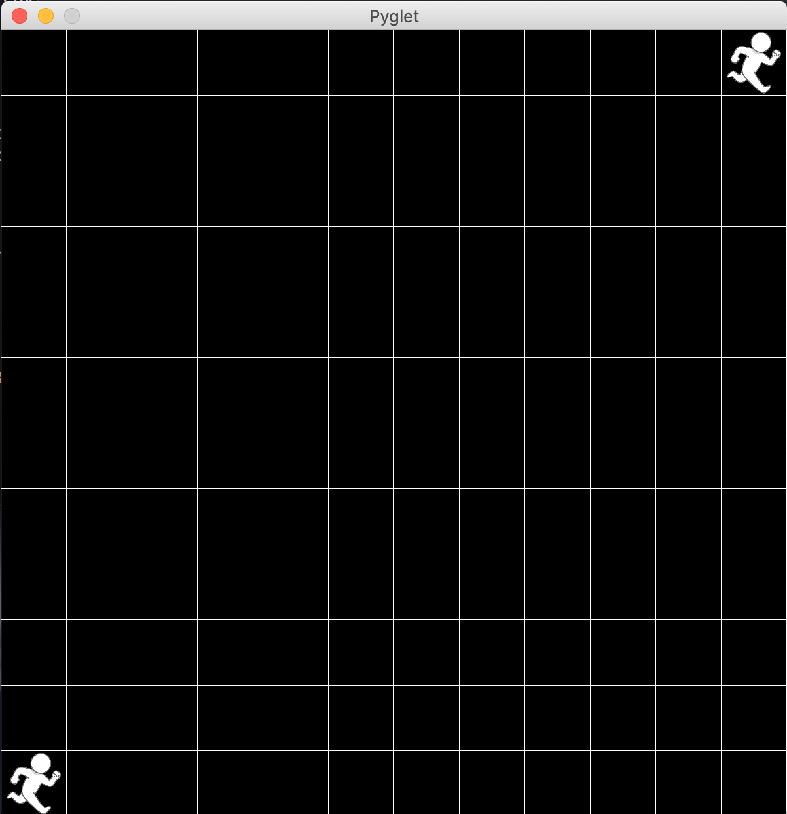
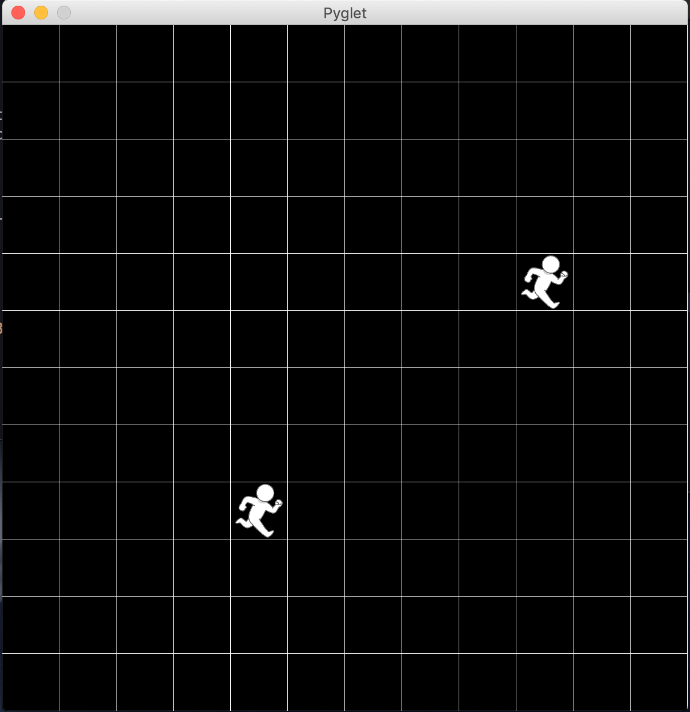
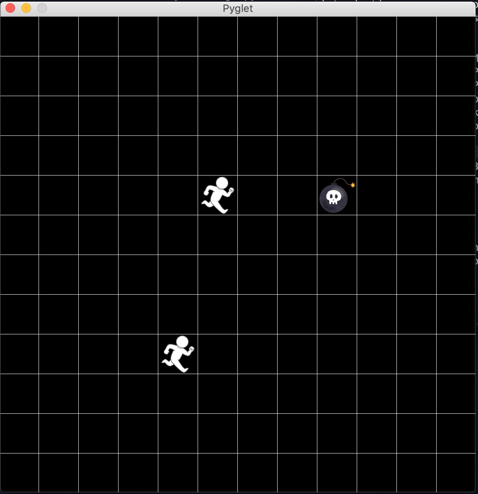
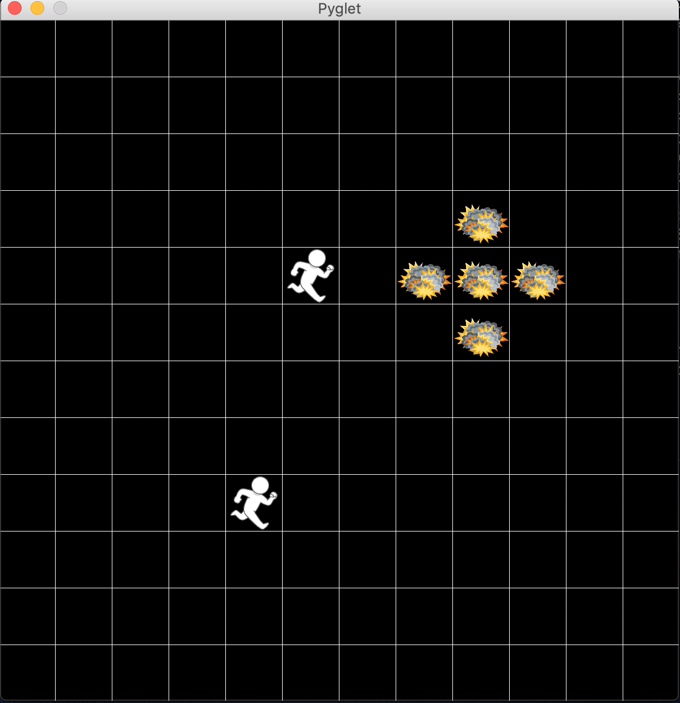
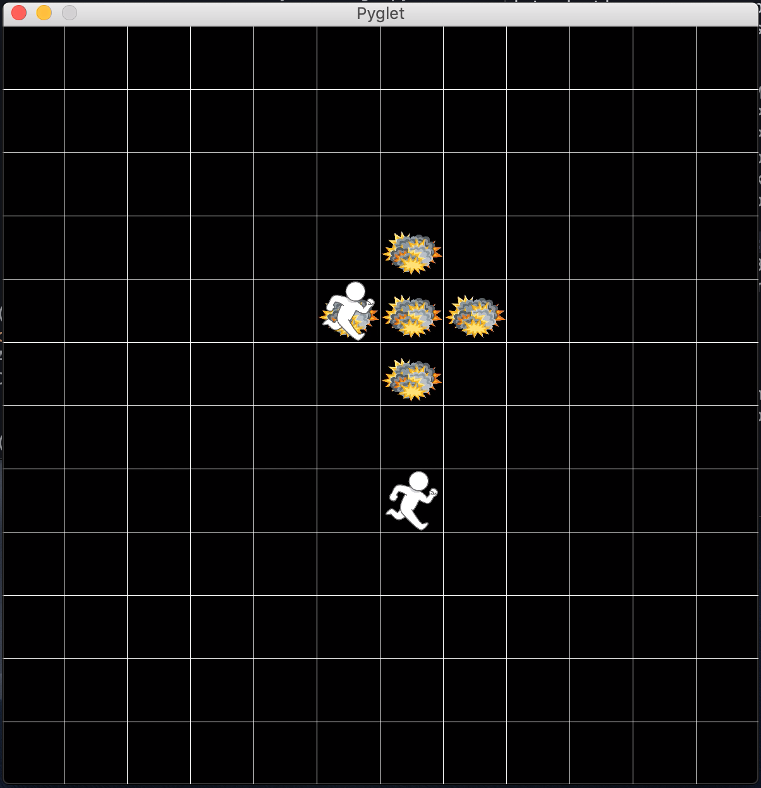
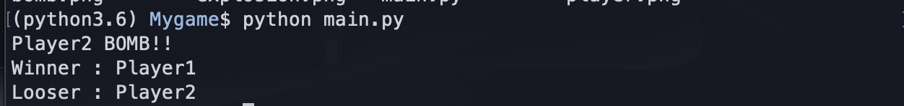

# Bomberman
This is a simple game like bomberman with pyglet.

## Usage
### startapp
$python main.py

then, window open and two players appear.

Player 1 is lower left.
Player 2 is upper right.

### How to move?
#### Player 1
W : UP  
D : RIGHT  
S : DOWN  
A : LEFT
#### Player 2
↑ : UP  
→ : RIGHT  
↓ : DOWN  
← : LEFT    

### How to put bomb?
#### Player 1
V
#### Player 2
M

bomb explode in 4 seconds after put.

You can win if you explode the enemy.

